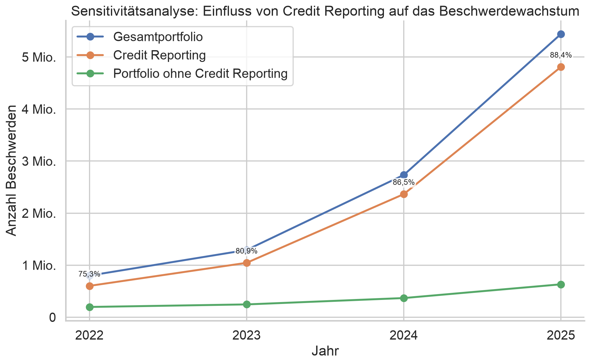
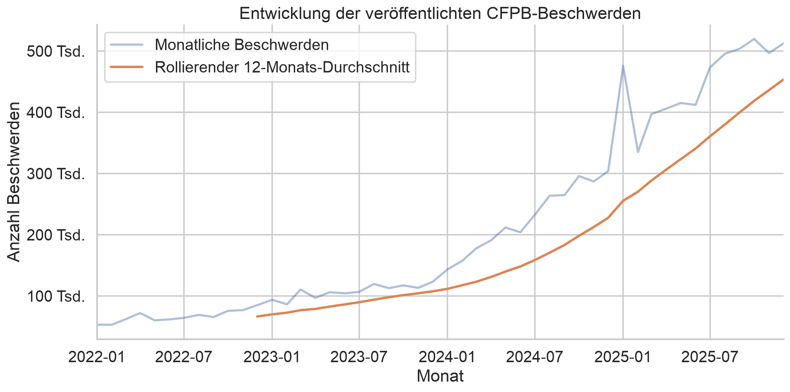
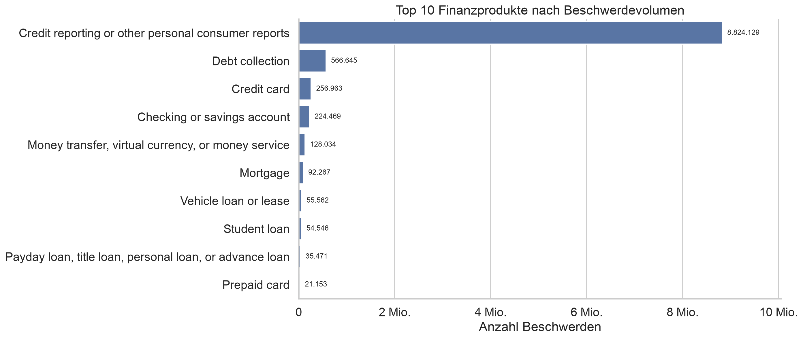
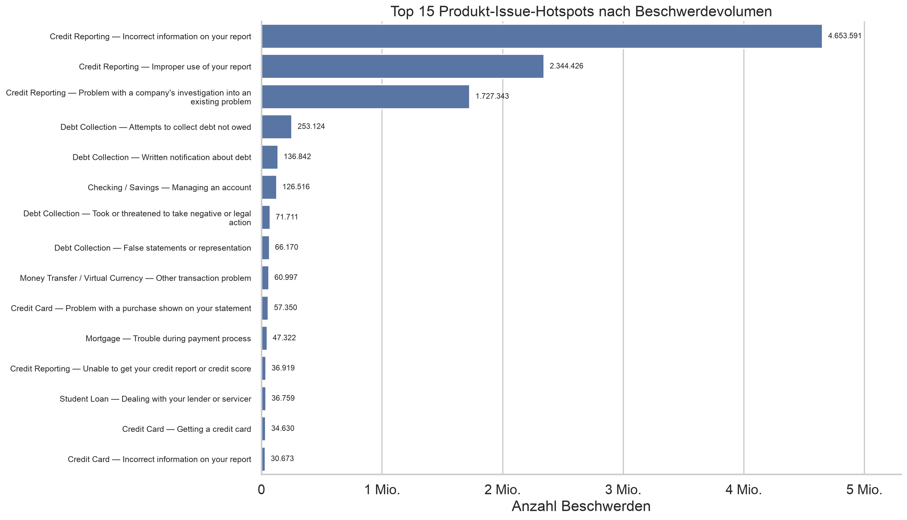
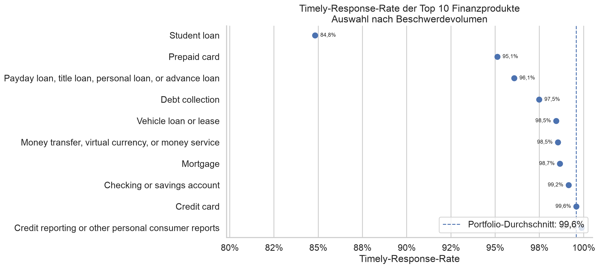
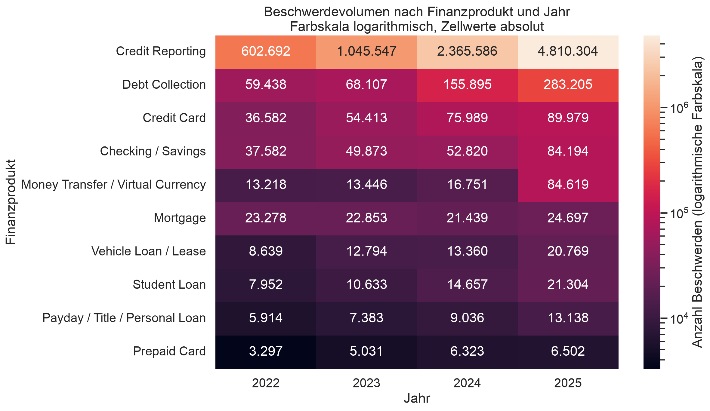

# Consumer Finance Complaint Intelligence Platform

**Reproduzierbare Exploratory Data Analysis für 10,27 Mio. veröffentlichte CFPB-Verbraucherbeschwerden (2022-2025).**

Das Projekt zeigt einen vollständigen analytischen Workflow für Financial Services: von Datenaufnahme und Datenbereinigung über Taxonomie-Harmonisierung und Quality Gates bis zu Zeitreihen-, Korrelations- und Sensitivitätsanalyse sowie Management-Reporting.

> **Modul 1 - Datenanalyse mit Python / EDA**  
> Fokus: belastbare Datenanalyse und Entscheidungsunterstützung - bewusst ohne künstlich ergänztes Machine Learning.

## Executive Snapshot

| Kennzahl | Ergebnis |
|---|---:|
| Beschwerden | **10.269.540** |
| Unternehmen | **5.601** |
| harmonisierte Produktgruppen | **11** |
| Analysezeitraum | **2022-2025** |
| Timely-Response-Rate | **99,6 %** |
| Wachstum 2022 → 2025 | **+580,2 %** |
| Credit-Reporting-Anteil 2025 | **88,4 %** |
| Tests | **24/24 bestanden** |

**Zentrale Erkenntnis:** Das Gesamtwachstum bleibt auch ohne Credit Reporting stark (+220,3 %), aber rund **91,2 % der Steigung des linearen Gesamttrends** entfallen rechnerisch auf den Credit-Reporting-Anteil der monatlichen Beschwerdereihe. Aggregierte Portfolio-KPIs werden dadurch erheblich vom Segmentmix geprägt.



## Warum dieses Projekt relevant ist

Eine klassische Notebook-EDA würde Beschwerdevolumen, Kategorien und Zeitverläufe beschreiben. Dieses Projekt geht einen Schritt weiter und prüft zuerst, **ob die Daten überhaupt konsistent interpretierbar sind**.

Der Workflow umfasst:

```text
Offizielle CFPB-Daten
        ↓
Reproduzierbarer Download + SHA-256-Provenienz
        ↓
Polars Lazy Transformation
        ↓
Datenbereinigung
        ↓
Taxonomie-Harmonisierung
        ↓
Automatisierte Quality Gates
        ↓
Explorative und statistische Analyse
        ↓
Segment-Sensitivitätsanalyse
        ↓
Visualisierung + Management Summary
```

Damit ist die Methodik auf Fragestellungen aus **Banking, Finanzdienstleistungen, Conduct Risk, Customer Operations, Versicherungen und Technical AI Consulting** übertragbar.

## Kernergebnisse

### 1. Beschwerdevolumen steigt stark

Die veröffentlichten Beschwerden steigen von **800.245 im Jahr 2022** auf **5.442.977 im Jahr 2025**. Der deskriptive lineare Monatstrend liegt bei rund **+10.511 Beschwerden pro Monat** mit **R² = 0,877**. Die Regression dient ausschließlich der Beschreibung des beobachteten Zeitraums und nicht als Forecast.



### 2. Credit Reporting dominiert das Portfolio

Die harmonisierte Produktgruppe `Credit reporting or other personal consumer reports` umfasst **8.824.129 Beschwerden** beziehungsweise **85,9 %** des gesamten Analysebestands.

Der Anteil steigt innerhalb des Analysefensters von **75,3 % (2022)** auf **88,4 % (2025)**.



### 3. Wenige Product-Issue-Hotspots dominieren

Der größte Hotspot ist:

```text
Credit Reporting
→ Incorrect information on your report
→ 4.653.591 Beschwerden
```

Weitere besonders große Credit-Reporting-Issues sind `Improper use of your report` und `Problem with a company's investigation into an existing problem`.



### 4. Response Operations unterscheiden sich nach Produkt

Die Timely-Response-Rate des Gesamtportfolios liegt bei rund **99,6 %**. Gleichzeitig fällt `Student loan` mit rund **84,8 %** deutlich ab.

Die Kennzahl wird bewusst nur als **exploratives Screening-Signal** verwendet. Ohne Kunden-, Marktanteils- oder Exposure-Nenner ist sie keine faire Performance-Rangliste.



### 5. Segmentkontrolle verändert statistische Zusammenhänge

Die Sensitivitätsanalyse vergleicht das Gesamtportfolio mit einem Portfolio ohne das dominante Credit-Reporting-Segment.

| Kennzahl | Gesamtportfolio | ohne Credit Reporting |
|---|---:|---:|
| Wachstum 2022 → 2025 | +580,2 % | **+220,3 %** |
| linearer Monatstrend | +10.511 | **+925** |
| Beschwerden ↔ Narrative-Anteil (Pearson) | -0,891 | **-0,227** |
| Beschwerden ↔ Timely Response (Pearson) | +0,343 | **-0,297** |

Die Analyse zeigt damit einen deutlichen **Segment- beziehungsweise Kompositionseffekt**. Sie wird bewusst **nicht vorschnell als Simpson-Paradox klassifiziert**.

## Datenqualität und Taxonomie

Die analytische Ebene trennt strikt zwischen unveränderten Source-Werten und analytischer Aufbereitung.

```text
Source:
product
issue

Analytisch zusätzlich:
harmonized_product
harmonized_issue
taxonomy_version
```

Im Rohdatensatz fehlen bei **6 Beschwerden** veröffentlichte Issue-Werte. Diese Beschwerden werden nicht gelöscht: `issue` bleibt leer, während für analytische Aggregationen zusätzlich `harmonized_issue = "Issue not provided"` verwendet wird.

**1.335.250 Beschwerden** beziehungsweise rund **13,0 %** des Analysebestands sind von einer Produktharmonisierung betroffen. Das vollständige Source-to-Analytical-Mapping wird als Audit veröffentlicht.

Der aktuelle reale Analysebestand besteht alle definierten strukturellen Quality Gates:

```text
passed = true
```

## Produktentwicklung nach Jahr

Die Heatmap verwendet eine logarithmische Farbskala, damit kleinere Produktgruppen trotz der extremen Größenunterschiede sichtbar bleiben. Die Zellwerte sind weiterhin absolute Beschwerdezahlen.



## Technologie-Stack

**Python 3.11+ · Polars · Pandas · NumPy · PyArrow · Parquet · SciPy · scikit-learn · Matplotlib · Seaborn · Plotly · pytest · Ruff · GitHub Actions**

Polars verarbeitet den Multi-Gigabyte-Rohdatensatz lazy und schreibt die Analysebasis direkt als Parquet. Für den EDA-Lauf werden nur benötigte Spalten geladen; wiederkehrende Textdimensionen werden speichereffizient als Kategorien repräsentiert.

## Repository-Struktur

```text
consumer-finance-complaint-intelligence/
├── .github/workflows/ci.yml
├── configs/project.yaml
├── data/
├── docs/
├── notebooks/01_executive_eda.ipynb
├── presentation/
├── reports/
│   ├── figures/
│   ├── executive_summary.md
│   ├── interactive_dashboard.html
│   └── ...
├── scripts/
├── src/data_intelligence_platform/
├── tests/
├── Makefile
├── pyproject.toml
└── README.md
```

## Reproduzierbarer Workflow

### Installation

```bash
python -m venv .venv
source .venv/bin/activate
python -m pip install --upgrade pip
pip install -e ".[dev]"
```

### Daten herunterladen

```bash
python scripts/download_data.py
```

### Gesamte Pipeline

```bash
python scripts/run_pipeline.py
```

### Analyse auf bestehendem Parquet erneut ausführen

```bash
python scripts/run_analysis.py
```

### Quality Gate

```bash
make quality
```

Aktueller Stand:

```text
24/24 Tests bestanden
pytest -W error: bestanden
Ruff: All checks passed
CI: Python 3.11 und 3.13
```

## Fertige Portfolio-Artefakte

Die kleinen Ergebnisdateien werden bewusst im Repository versioniert, damit Reviewer die Analyse ohne Download des Multi-Gigabyte-Rohdatensatzes prüfen können.

Wichtige Einstiegspunkte:

- [`reports/executive_summary.md`](reports/executive_summary.md) - Management Summary
- [`notebooks/01_executive_eda.ipynb`](notebooks/01_executive_eda.ipynb) - narrative Executive EDA
- [`reports/interactive_dashboard.html`](reports/interactive_dashboard.html) - interaktives Plotly-Dashboard
- [`reports/source_snapshot.json`](reports/source_snapshot.json) - öffentlicher Daten-Snapshot-Nachweis
- [`docs/methodology.md`](docs/methodology.md) - Methodik
- [`docs/architecture.md`](docs/architecture.md) - Architektur
- [`docs/data_dictionary.md`](docs/data_dictionary.md) - Datenwörterbuch
- [`docs/limitations.md`](docs/limitations.md) - Responsible Interpretation
- [`presentation/consumer_finance_complaint_intelligence_presentation.pdf`](presentation/consumer_finance_complaint_intelligence_presentation.pdf) - Abschlusspräsentation

## Responsible Interpretation

Die CFPB Consumer Complaint Database ist keine repräsentative Stichprobe aller Kundenerfahrungen. Deshalb gilt im gesamten Projekt:

- Beschwerdevolumen ist keine direkte Qualitätskennzahl.
- Korrelation beweist keine Kausalität.
- Unternehmensvergleiche benötigen geeignete Exposure-Nenner.
- Der lineare Trend ist keine Prognose.
- Ein Kompositionseffekt ist nicht automatisch ein Simpson-Paradox.
- Externe Complaint-Daten ersetzen keine internen Kunden-, Prozess- oder Risikodaten.

## Mögliche Weiterentwicklung

Der aktuelle Stand bleibt bewusst ein **EDA-/Datenanalyse-Projekt**. Naheliegende spätere Erweiterungen wären NLP auf Consumer Narratives, Topic Modeling, Embeddings, ML-Klassifikation, Anomalieerkennung, automatisierte Datenaufnahme und Taxonomy-Drift-Monitoring.

## Portfolio-Positionierung

Das Repository demonstriert insbesondere:

```text
Business-Frage
→ Data Engineering
→ Data Cleaning
→ Data Quality
→ Taxonomy Management
→ Exploratory Analysis
→ Statistical Analysis
→ Sensitivity Analysis
→ Visualization
→ Management Interpretation
```

Damit zeigt das Projekt nicht nur Python-Kenntnisse, sondern einen vollständigen analytischen Problemlösungsprozess für Financial Services und Technical AI Consulting.

## Autor

**Maik Hübner**  
AI Engineering · Data Analysis · Machine Learning · Financial Services

---

*Unabhängige Portfolioanalyse auf Basis öffentlich verfügbarer CFPB-Daten. Es besteht keine Verbindung zum Consumer Financial Protection Bureau; das Projekt wird vom CFPB nicht unterstützt oder empfohlen.*
